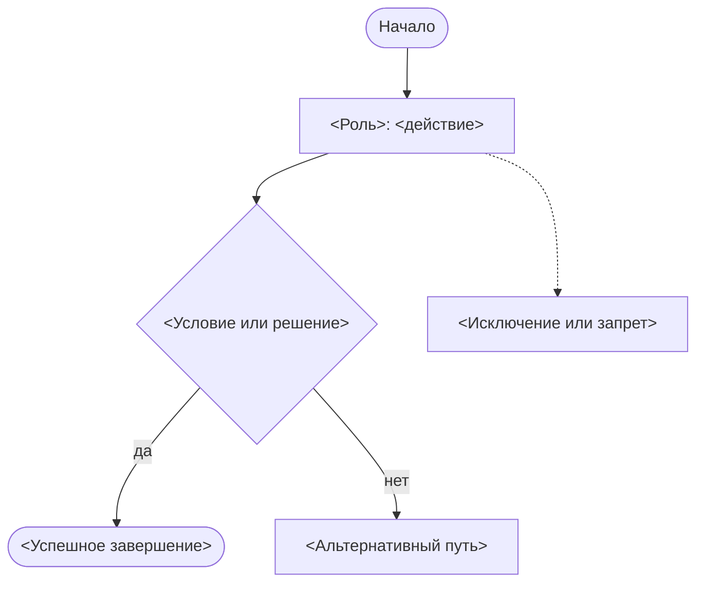
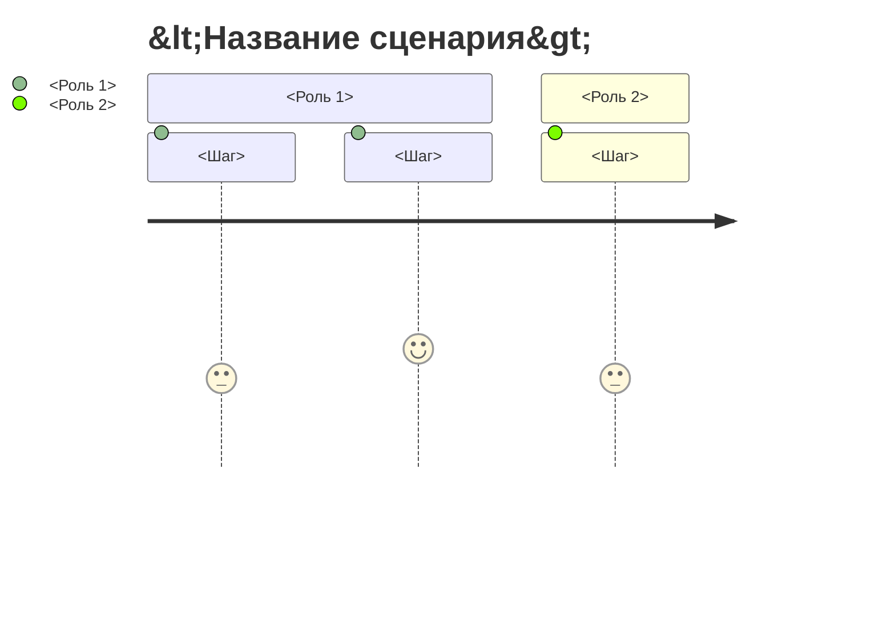

# Scenario map Mermaid template

Использовать как дополнительную визуализацию к `Delivery readiness pack`, когда команде полезно увидеть путь пользователя или общий flow процесса.

Файл сохраняется как `product/scenario-map.mmd`.

## Вариант 1: flowchart

## Вариант 2: journey

## Правила

- Выбирай `flowchart`, если важны ветвления, запреты и альтернативы.
- Выбирай `journey`, если важен путь по ролям и последовательность участия.
- Не добавляй экранов, системных компонентов или технических действий, которых нет в артефактах.
- Каждый узел должен быть понятен человеку без знания ID требований.
- Если шаг является предположением, помечай его как `candidate` или выноси в вопросы, а не изображай как подтвержденный flow.
