# Шаблон: Диаграмма состояний

Использовать как дополнительный артефакт этапа `spec-structurer`, если в требованиях есть статусы, состояния, этапы жизненного цикла или правила переходов.

```text
Диаграмма состояний

Формат: mermaid

```mermaid
stateDiagram-v2
  [*] --> <Начальное_состояние>

  <Состояние_1> --> <Состояние_2>: <событие / условие перехода>
  <Состояние_2> --> <Состояние_3>: <событие / условие перехода>
  <Состояние_3> --> <Конечное_состояние>: <событие / условие перехода>
```


```

## Правила использования

- Это вспомогательный артефакт для визуализации поведения, а не замена `Спецификации`.
- Использовать только mermaid `stateDiagram-v2`.
- Каждое состояние и каждый переход должны иметь опору в текстовой `Спецификации`.
- Если правило перехода не определено, его нельзя изображать как подтвержденный переход.
- Имена состояний должны быть однозначными и соответствовать терминологии спецификации.
- Если начальное состояние неизвестно, это должно попадать в `Открытые вопросы`, а не маскироваться произвольным выбором.
