# State model Mermaid template

Использовать как дополнительную визуализацию к `Delivery readiness pack`, если в спецификации есть подтвержденные состояния, статусы или переходы жизненного цикла.

Файл сохраняется как `team/state-model.mmd`.

```mermaid
stateDiagram-v2
  [*] --> <Начальное_состояние>: <событие>
  <Состояние_1> --> <Состояние_2>: <событие / условие>
  <Состояние_2> --> <Состояние_3>: <событие / условие>
  <Терминальное_состояние> --> [*]
```

## Правила

- Показывай только состояния и переходы, подтвержденные в `Спецификация / Модель состояний / Переходы`.
- Не дорисовывай начальное состояние, если оно не определено.
- Не дорисовывай терминальные состояния без источника.
- Если переход запрещен, не изображай его обычной стрелкой. Укажи запрет в readiness pack или отдельной заметке.
- Названия состояний должны совпадать с терминологией спецификации.
- Если state model неприменима, файл `state-model.mmd` не создается, а в readiness pack указывается причина.
